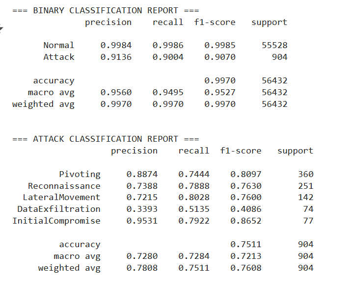
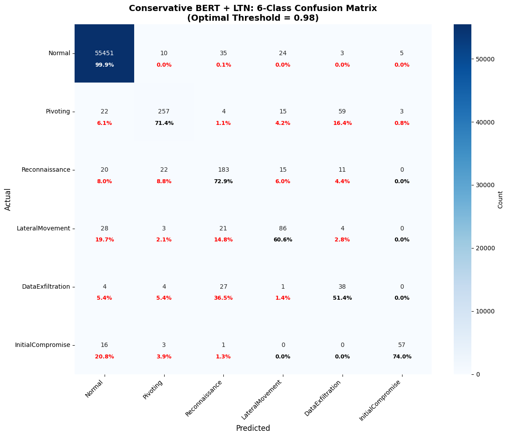

# LTN‑BERT: Neuro‑Symbolic APT Detection on SCVIC‑APT‑2021

This repository contains an implementation of a **neuro‑symbolic intrusion‑detection pipeline** that combines a neural encoder (BERT‑based) with **Logic Tensor Networks (LTN)** to detect **Advanced Persistent Threats (APTs)** from labeled network‑flow records in **SCVIC‑APT‑2021**. The goal is to achieve strong detection performance **with explicit, inspectable logic** for operational use in security operations.

---

## 1) Dataset

We use the SCVIC‑APT‑2021 traffic‑flow dataset with the following labels:
`NormalTraffic`, `InitialCompromise`, `Pivoting`, `Reconnaissance`, `LateralMovement`, `DataExfiltration`.

Place the CSVs like this:
```
data/
 ├─ Training.csv
 └─ Testing.csv
```

---

## 2) Environment & Setup

Clone and install:
```bash
git clone https://github.com/qfath001/mobicom-artifacts-2025.git
cd mobicom-artifacts-2025
pip install -r requirements.txt
```

Open the Colab notebook at `notebooks/MOBICOM_CODE.ipynb`, set `DATA_DIR` to your local `data/`, then **Runtime → Run all**.

---

## 3) Data Audit (before cleaning)

- Shapes: **Train (259,120 × 84)**, **Test (56,487 × 84)**
- Duplicates: **179** (train), **55** (test)
- Missing values:
  - `Flow Bytes/s`: **1,758** (train), **525** (test)
  - `Flow ID`: **1** (train)
- Label imbalance (train): `NormalTraffic` dominates; rarest class is `InitialCompromise`.

These figures are printed in the first audit cells of the notebook (shapes, duplicate counts, missing values, and per‑class label counts).

---

## 4) Data Cleaning & Integrity Fixes

1. **Drop duplicates** in train and test.
2. **Drop the single row with missing `Flow ID`** in train.
3. **Impute `Flow Bytes/s`** for rows where it is missing:
   - Compute `Total_Bytes = Total Length of Fwd Packet + Total Length of Bwd Packet`.
   - Convert `Flow Duration` from microseconds to seconds.
   - If `Flow Duration > 0`, set `Flow Bytes/s = Total_Bytes / (Flow_Duration_sec)`; else set to `0`.
4. **Detect and remove corrupted “Idle” features** (`Idle Mean`, `Idle Std`, `Idle Max`, `Idle Min`), which exhibit extreme, non‑physical values (O(10^15)) across nearly all rows. These four columns are **dropped**.
5. **Fix impossible negatives**:
   - `Flow Duration` had **32** negatives → set to **0**.
   - `Flow Packets/s` had **32** negatives → set to **0`**.
6. **Handle infinite rates** (from zero‑duration divisions, etc.). Replace `inf` in rate features with the **99.9th percentile of their finite values** (per column). Observed counts before fixing:
   - Train: `Flow Bytes/s` **51**, `Flow Packets/s` **1,809**
   - Test: `Flow Bytes/s` **35**, `Flow Packets/s` **560**

**After basic cleaning (before column drops):**
- Train: **258,940 × 84**, Test: **56,432 × 84**
- Train label distribution unchanged except for duplicate removal.

**After dropping corrupted columns and fixing negatives:**
- Final schema: **80 numeric/predictive columns** (from 84).  
- Train: **258,940 × 80**, Test: **56,432 × 80**.  
- Remove the last residual duplicate in train → **258,939 × 80**.

---

## 5) Normalization Strategy (feature‑aware)

Features are grouped and scaled according to their behavior:

- **No normalization (kept in native scale)**: categorical/binary or near‑constant fields such as
  `Protocol`, TCP flag counts (`FIN/SYN/URG/CWR/ECE`), `Fwd/Bwd PSH/URG Flags`, `Subflow Fwd/Bwd Packets`, bulk/active stats that are zero/constant.
- **RobustScaler** (heavy‑tailed / outlier‑prone):
  `Flow Duration`, `Flow Bytes/s`, `Flow Packets/s`, `Fwd Packets/s`, `Bwd Packets/s`, `Total Length of Fwd/Bwd Packet`, `Packet Length Variance`, `Bwd Bulk Rate Avg`.
- **StandardScaler** (the rest), **including ports**: `Src Port`, `Dst Port` are intentionally normalized to help models learn port‑based attack patterns.

Summary from the notebook run:
- No‑normalize: **18** features
- Robust‑normalize: **9** features
- Standard‑normalize: **50** features

A verification cell confirms **no NaN/inf** remain post‑scaling and shows example ranges for
`Flow Duration`, `Flow Bytes/s`, `Total Fwd Packet`, `Src Port`, `Protocol`.

---

## 6) Feature Analysis

To identify discriminative features for LTN rule design and to de‑bias class imbalance during ranking, the notebook computes multiple importance signals:

- **Random Forest** (`class_weight="balanced"`) feature importance
- **Extra Trees** feature importance
- **Mutual Information** scores
- **ANOVA F‑test** scores

Consistent “top” features include (illustrative subset; see notebook printouts for full lists and exact ranks):

- `FWD Init Win Bytes`
- `Dst Port`, `Src Port`
- `Subflow Bwd Bytes`
- `Bwd Header Length`
- `ACK Flag Count`
- `Flow IAT Min`
- `Total Length of Bwd Packet`, `Total Length of Fwd Packet`
- `Packet Length Max`, `Packet Length Std`
- `Fwd Header Length`, `Bwd Init Win Bytes`
- `Fwd Packet Length Max`

A **consensus ranking** (average of ranks across methods) is computed to stabilize selection; it flags high‑confidence signals that repeatedly appear in the top‑K across methods.

---

## 7) Modeling (BERT + LTN)

- **Neural encoder (BERT‑based)**: produces dense representations over the cleaned and normalized flow features (feature tokenization/ordering documented in the notebook).
- **Logic Tensor Networks (LTN)**: we encode a small set of **first‑order logic rules** using the high‑confidence features above. Typical rule templates include:
  - Thresholds and monotonicity constraints (e.g., high `Packet Length Max` AND elevated `Dst Port` bucket → raises belief in `DataExfiltration`).
  - Consistency constraints between related statistics (e.g., header lengths vs. total lengths).
  - Class‑exclusion constraints where patterns contradict each other.
- **Training**: LTN truth values are combined with supervised labels in a joint loss to regularize the neural encoder and improve interpretability.
- **Evaluation**: macro‑averaged metrics are reported for: binary APT detection and 6‑class stage classification.

---

## 8) Reproducing Results

1. Open `notebooks/MOBICOM_CODE.ipynb` in Colab.
2. Set `DATA_DIR` to your `data/` folder.
3. Run the notebook end‑to‑end:
   - Section “Data Audit & Cleaning” prints shapes, duplicates, missing value counts, and fixes.
   - Section “Normalization” prints category decisions and verifies no inf/NaN remain.
   - Section “Feature Analysis” prints the per‑method top‑K lists and the consensus ranking.
   - Section “Modeling & Evaluation” trains the LTN‑BERT hybrid and prints the classification report.
4. Optionally export cleaned tensors and the feature index used by the model for future runs.

---

## 9) Evaluation Results

### Binary Classification (Normal vs. Attack)
The model achieves **99.7% overall accuracy** with a **macro F1 of 0.953**, demonstrating strong separation between benign and malicious traffic.



### Multi-Class Attack Classification
For fine-grained attack stage detection, the model reaches a **macro F1 of 0.721** across five APT stages.  
Performance is highest on **Initial Compromise** and **Pivoting**, while **Data Exfiltration** remains the most challenging due to limited samples.



**Key Observations:**
- Binary detection is highly reliable (F1 > 0.95).  
- Multi-class classification highlights realistic difficulty of distinguishing low-frequency attack types.  
- Conservative thresholding (0.98) maintains high precision while retaining recall.  

---

## 10) Repository Layout

```
├── data/                     # Place Training.csv, Testing.csv here (ignored by git)
│   └── README.md             # Dataset link and notes (optional)
├── notebooks/
│   └── MOBICOM_CODE.ipynb    # End-to-end Colab notebook (audit → modeling → eval)
├── docs/
│   └── LTN+BERT_IMPROVINGF1_Colab.pdf   # Printable version of the notebook
├── requirements.txt          # Exact dependencies for reproducibility
└── README.md                 # This file
```

---

## 11) Notes on Class Imbalance & Robustness

- The dataset is **highly imbalanced** (NormalTraffic ~98% of train). Class‑weighted estimators and macro‑averaged metrics are used. Consider stratified sampling or cost‑sensitive learning for additional robustness.
- The four “Idle” columns were removed due to clear corruption and non‑physical magnitudes across nearly all rows.
- Rate features are prone to division‑by‑zero when flow durations are zero; the pipeline explicitly addresses `inf` and `NaN` cases and uses robust scaling for heavy‑tailed distributions.

---

## 12) Acknowledgments

- Advisor: **Dr. Neda Moghim**, VMASC @ Old Dominion University
- Dataset: **SCVIC‑APT‑2021** (Security‑labeled network flows)
- Thanks to collaborators and reviewers for feedback on rule templates and evaluation design.
